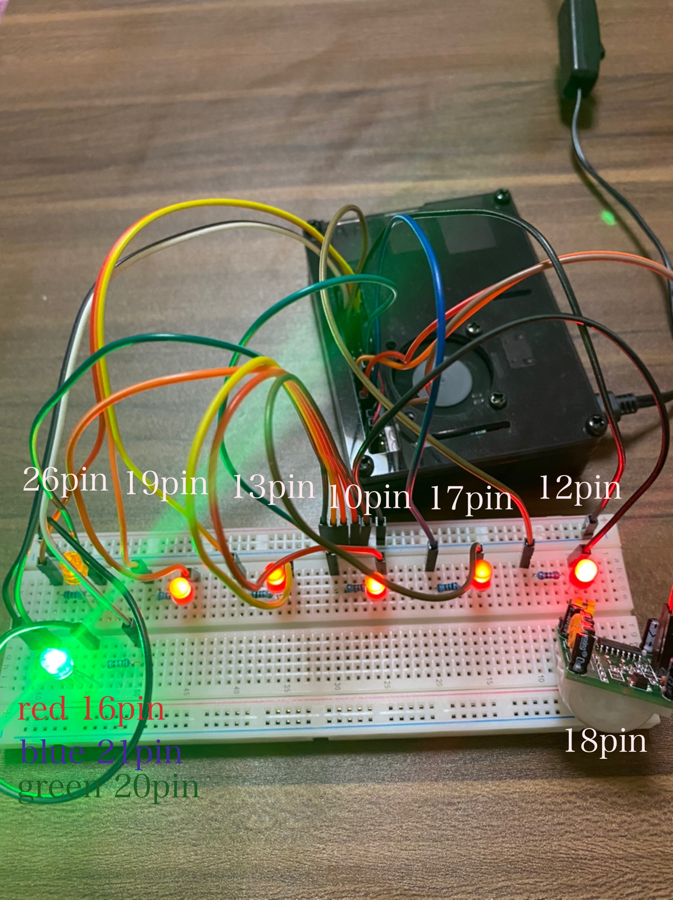

# studyPi
 
 勉強時間を自動計測し、友達と共有できるWebサービス
 
 2020年度みんなのラズパイコンテスト学生証受賞作品。https://project.nikkeibp.co.jp/pc/rpic/

# Demo
[Watch the video](https://www.youtube.com/watch?v=OrJLxV1gePw)

# Features

 コロナウイルスの流行で、私たちの学生生活は大きく変化しました。今年の３月から大学への入校が禁止となり、春からの授業は全てオンライン授業となりました。私たちは現在学部の3年生で、春からゼミへ配属となりました。ゼミの活動は、例年とは違いすべてオンラインでの実施となりました。ゼミの同期には、まだオンラインでしか顔を合わせたことがないメンバーもいます。私たちの所属するゼミは、「ネットやウェブなどに加えて，センサによって取得した実世界の情報を融合することによって，社会や生活の役に立つサービスを創出すること」を目標に掲げ活動しています。３年次では、４年次に始まる卒業研究に向けて技術力の養成を行います。例年は、ゼミ室にこもったりして、お互いに切磋琢磨しながら勉強をしており、私たちもそのようなゼミ活動を思い描いていました。しかし、今年はそれができませんでした。その結果、勉強に対するモチベーションが維持できなかったり、周りの様子が分からず不安を感じたりしていました。この問題を今まで身につけてきた技術力を使って解決しようと考えました。著者:masaki987654321(https://github.com/masaki987654321)

 
# Enviroment
 * raspbian buster
 * python 3.7.3
 * pipenv 2020.8.13
 * Pyrebase 3.0.27
 * responder 2.0.5
 * RPi.GPIO 0.7.0
 * SQLAlchemy 1.3.19
 
# Installation
 
 pipenv(https://pipenv.pypa.io/en/latest/)をインストール
 ```bash
 git clone https://github.com/moffy-Black/studyPi.git
 cd ~/studyPi/responder
 pipenv install
 ```
 
# Usage
 
 回路を組む
 
 ```bash
 cd ~/studyPi/responder
 pipenv migrate
 pipenv server
 ```
 
# Author
 moffy-Black

# Collaborator
  
 * ErinaSchool(https://github.com/ErinaSchool)
 * masaki987654321(https://github.com/masaki987654321)
 * marusann(https://github.com/marusann)
 
